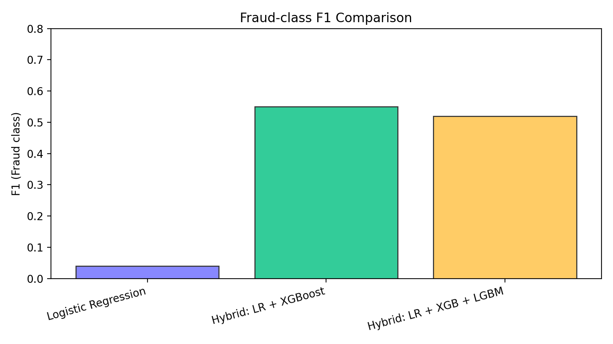

### Transaction Fraud Detection

This project provides an end-to-end look at detecting fraudulent financial transactions using machine learning. It covers the entire workflow from initial data exploration to training and evaluating a predictive model.


### About the Project

The core problem for financial companies is a constant balancing act: catching fraudulent transactions without accidentally blocking legitimate customer payments. Missing a fraud costs money, but false alarms can damage customer trust.

This project was built with a clear goal in mind: create a model that prioritizes catching as many frauds as possible (high **Recall**) while also keeping the false alarms low (good **Precision**). The final output is a trained model and a detailed analysis of its performance.

-----

### The Dataset

  * The dataset is not uploaded here but can be found on Kaggle.
  * **Size:** Over 6 million rows and 11 columns of transaction data.
  * **Key points:** There are no missing values, but a significant challenge is the extreme **class imbalance** i.e, frauds make up a tiny fraction of the total transactions.

-----

### How it Works

The project follows a standard data science process.

#### 1\. Data Exploration

  * **Initial Analysis:** We first looked at transaction types and found that only `TRANSFER` and `CASH_OUT` transactions showed any fraudulent activity.
  * **Creating Features:** Two new features, `balanceDiffOrig` and `balanceDiffDest`, were engineered to better represent changes in account balances.
  * **Feature Selection:** We decided to drop some columns like `nameOrig` and `nameDest` since they weren't needed for the model.

#### 2\. Modeling

  * **Model Choice:** Three different models were built into a `scikit-learn` pipeline.
  * **Data Preparation:** Before training, numeric features were scaled and the transaction type was converted into a format the model could understand.
  * **Training:** The data was split into training (70%) and testing (30%) sets.

-----


### Getting Started

You have two options for running the project.

#### Run Locally

1.  **Dependencies:** Make sure you have **Python 3.8+** and a notebook environment like Jupyter.
2.  **Clone:** Get a copy of the project from the repository.
    ```bash
    git clone https://github.com/khushijha-kj/Transaction_Fraud_Detection.git
    cd Transaction_Fraud_Detection
    ```
3.  **Setup:** Create a virtual environment and install the required libraries.
    ```bash
    python3 -m venv venv
    source venv/bin/activate
    pip install pandas numpy scikit-learn matplotlib seaborn joblib
    ```
4.  **Run:** Place the `Fraud.csv` file inside a `dataset` folder in the project directory and run the notebook to generate the model and results.

-----

## Model Comparison and Results

We evaluated three models with the primary goal of maximizing the F1 score for the fraud class (1), which balances precision (avoiding false alarms) and recall (catching frauds) under heavy class imbalance.

- Logistic Regression (baseline)
  - Precision (fraud): 0.02
  - Recall (fraud): 0.94
  - F1 (fraud): 0.04
  - Accuracy: ~95.0%

- Hybrid: Logistic Regression + XGBoost
  - Precision (fraud): 0.38
  - Recall (fraud): 0.98
  - F1 (fraud): 0.55
  - Accuracy: ~99.8%

- Hybrid: Logistic Regression + XGBoost + LightGBM
  - Precision (fraud): 0.35
  - Recall (fraud): 0.99
  - F1 (fraud): 0.52
  - Accuracy: ~99.8%

Recommendation

- The Hybrid (Logistic Regression + XGBoost) achieves the highest F1 (0.55) and offers the best balance between catching fraud and avoiding false alarms. Choose this model for deployment.

Notes

- Metrics reflect a specific train/test split and may vary slightly with different seeds or splits.
- For production, consider threshold tuning on validation data to optimize F1 or a business-specific cost function.

### F1 Comparison (Fraud Class)



---

### Future Work

While the current hybrid model performs well, the project can be extended in several key areas to further improve performance and real-world applicability:

- Hyperparameter Tuning: Use GridSearchCV or RandomizedSearchCV to find optimal settings for XGBoost and LightGBM; this can further boost the F1 score.
- Advanced Feature Engineering: Create features like transaction frequency, historical average amounts, and flags for new destination accounts before dropping fields.
- Model Explainability: Apply SHAP (SHapley Additive exPlanations) to understand and communicate why the model flags transactions as fraud.
- Deployment: Expose the trained pipeline via a simple Flask or FastAPI service to enable real-time fraud scoring in downstream systems.
